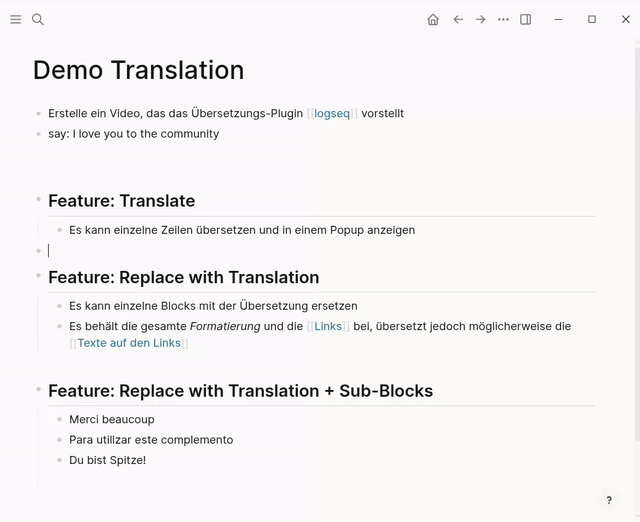
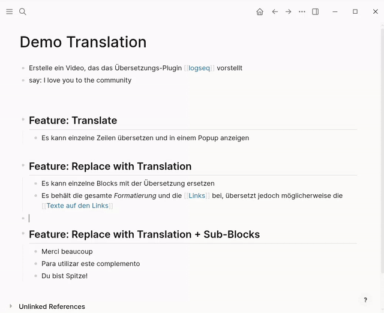
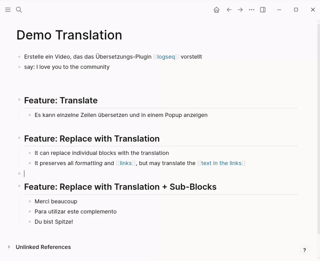

# 🌐 DeepL Translator - Logseq Plugin

A powerful Logseq plugin that translates block content using the DeepL API. Supports 30+ languages with automatic source language detection.

## Features

- 🌐 **Multi-language support** - Translate to/from 30+ languages
- 🔄 **Three translation modes:**
  - **Show Translation** - Display translated text in a dialog
  - **Replace with Translation** - Inline replace block content with translated text
   - **Replace with Translation + Sub-blocks** - Inline replace parent block and all nested sub-blocks
- ⚡ **Fast performance** - Lightweight bundled plugin
- 🎯 **Block-level translation** - Right-click any block to translate
- ⌨️ **Custom keyboard shortcuts** - Optional per-action shortcut settings for all three actions
- 🌍 **Auto-language detection** - Automatically detects source language

## Installation

1. **Get DeepL API Key**
   - Sign up for free at [DeepL API](https://www.deepl.com/docs-api)
   - Copy your API key

2. **Load Plugin in Logseq**
   - Open Logseq
   - Go to **Plugins** → **Marketplace**
   - Search **DeepL Translator**
   - Click "Install"

3. **Configure API Key**
   - Click the plugin settings icon (⚙️)
   - Paste your DeepL API key
   - (Optional) Set default target language (default: EN)
   - (Optional) Enable Pro API if you have a Pro account (untested)

## Usage

## Demo

### Show Translation


### Replace with Translation


### Replace with Translation + Sub-blocks


### Show Translation (Dialog)
1. Right-click any block in Logseq
2. Click **"🌐 Translate"**
3. Translation appears in a dialog
4. Click outside dialog to close

### Replace with Translation (Inline)
1. Right-click any block in Logseq
2. Click **"🌐 Replace with Translation"**
3. Block content is replaced with the translated text

### Replace with Translation + Sub-blocks (Inline)
1. Right-click any block in Logseq
2. Click **"🌐 Replace with Translation + Sub-blocks"**
3. The parent block and all nested sub-blocks are translated in place

### Keyboard Shortcuts
You can define optional shortcuts in plugin settings for each action:
- **Shortcut: Translate**
- **Shortcut: Replace with Translation**
- **Shortcut: Replace with Translation + Sub-blocks**

Example shortcut formats:
- `mod+shift+t`
- `mod+shift+r`
- `mod+shift+b`

When configured, the shortcut is also shown in the block context menu label.

## Supported Languages

The plugin supports all DeepL languages.

## Configuration

Open plugin settings to customize:

| Setting                                         | Type    | Default | Description                                                            |
| ----------------------------------------------- | ------- | ------- | ---------------------------------------------------------------------- |
| API Key                                         | String  | -       | Your DeepL API key (required)                                          |
| Default Target Language                         | String  | EN      | Target language for translations                                       |
| Use Pro API                                     | Boolean | false   | Enable for DeepL Pro accounts                                          |
| Shortcut: Translate                             | String  | -       | Optional keyboard shortcut for "Translate"                             |
| Shortcut: Replace with Translation              | String  | -       | Optional keyboard shortcut for "Replace with Translation"              |
| Shortcut: Replace with Translation + Sub-blocks | String  | -       | Optional keyboard shortcut for "Replace with Translation + Sub-blocks" |

## How It Works

1. **Block Context Menu** - Plugin registers three menu items on every block
2. **Content Retrieval** - Fetches block content via Logseq Editor API
3. **API Call** - Sends text to DeepL API with authentication
4. **Display/Replace** - Shows result in dialog or replaces block(s) inline
5. **Shortcut Commands** - Optional shortcuts trigger the same three actions on the active block
6. **Auto-detect** - DeepL automatically detects source language

## API Details

- **Free Tier:** Uses `https://api-free.deepl.com/v2/translate`
- **Pro Tier:** Uses `https://api.deepl.com/v2/translate`
- **Rate Limits:** Depends on your DeepL plan
- **Authentication:** Bearer token via `Authorization` header

## Troubleshooting

### "Translation failed: DeepL API error 403: Forbidden."
- ✅ Solution: Add your API key in plugin settings
- ✅ Solution: Check your API key is valid and not expired

### "Translation Error: Could not retrieve block content"
- ✅ Solution: Ensure the block has text content

### "DeepL API error 400: Bad request"
- ✅ Verify Pro/Free API setting matches your DeepL account

### "Translation failed: DeepL API error 400: Bad request. Reason: Value for 'target_lang' not supported."
- ✅ Use only legal language code like 'DE'

### Translation failed: DeepL API error 456: Quota Exceeded 
- ✅ Your API plan has reached its limitations. Wait until the next billing period, or update to pro.

## Project Structure

```
logseq-plugin-deepl-translate/
├── .github/
│   └── workflows/
│       └── release.yml          # Semantic-release CI/CD pipeline
├── src/
│   ├── main.ts                 # Main plugin entry point
│   ├── api/
│   │   └── deepl.ts             # DeepL API client
│   ├── types/
│   │   └── index.ts             # TypeScript interfaces
│   └── ui/
│       └── dialog.ts            # Translation dialog UI
├── .eslintignore                # Git ignore rules
├── index.html                   # Plugin HTML entry point
├── manifest.json                # Logseq marketplace manifest
├── package.json                 # Dependencies & metadata
├── package-lock.json            # Locked dependency versions
├── release.config.js            # Semantic-release configuration
├── tsconfig.json                # TypeScript compiler config
├── logo.png                     # Plugin icon
├── README.md                    # This file
└── CHANGELOG.md                 # Auto-generated release notes
```

## Development

### Requirements
- **Node.js:** 24 LTS or later
- **npm:** 10.x or later

### Setup
```bash
# Install dependencies
npm install

# Build the plugin
npm run build

# Run semantic-release (creates releases and tags)
npm run release
```

### Scripts
- `npm run build` - Compile TypeScript and bundle for browser
- `npm run release` - Create a semantic-release (requires conventional commits and git push to `main`)

## Dependencies

- `@logseq/libs` - Logseq plugin SDK
- `esbuild` - Bundler (dev)
- `typescript` - Language (dev)

## License

MIT

## Author

- GitHub Copilot / Auto-Model 12/2025
- Nillorian


## Support

For issues or feature requests, please create an issue in the repository.


**Note:** This plugin requires internet connection to communicate with DeepL API. Your text is sent to DeepL servers for translation.


## Release & CI

- **Automatic releases:** This repository is configured to use `semantic-release` to derive versions and changelogs from conventional commit messages and to create GitHub releases.
- **Workflow:** A GitHub Actions workflow runs on pushes to `main` (and via `workflow_dispatch`) and will run `npm ci`, `npm run build`, and then `npx semantic-release`.
- **Token:** The workflow uses the built-in `GITHUB_TOKEN` secret to create release artifacts — no extra token is required for basic releases. If you want to publish to npm or other services, add the appropriate secrets and adjust `release.config.js`.
